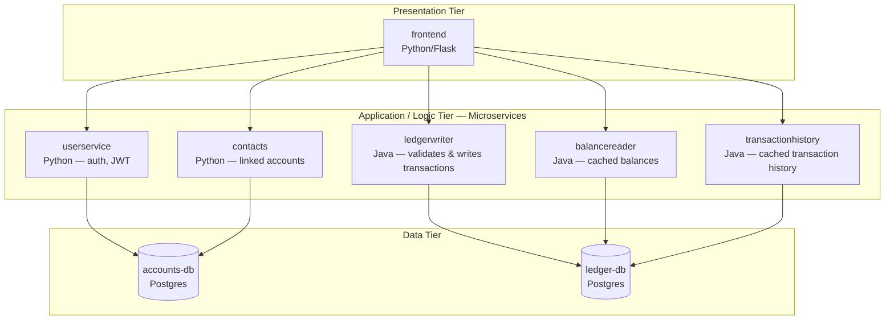

# devops-banking-platform
Production-style Docker, Kubernetes, and CI/CD pipeline for Google's open-source Bank of Anthos app

## Architecture

```mermaid
graph TB
    subgraph Presentation["Presentation Tier"]
        FE[frontend<br/>Python/Flask]
    end

    subgraph Application["Application / Logic Tier — Microservices"]
        US[userservice<br/>Python — auth, JWT]
        CT[contacts<br/>Python — linked accounts]
        LW[ledgerwriter<br/>Java — validates & writes transactions]
        BR[balancereader<br/>Java — cached balances]
        TH[transactionhistory<br/>Java — cached transaction history]
    end

    subgraph Data["Data Tier"]
        ADB[(accounts-db<br/>Postgres)]
        LDB[(ledger-db<br/>Postgres)]
    end

    FE --> US
    FE --> CT
    FE --> LW
    FE --> BR
    FE --> TH

    US --> ADB
    CT --> ADB
    LW --> LDB
    BR --> LDB
    TH --> LDB
```