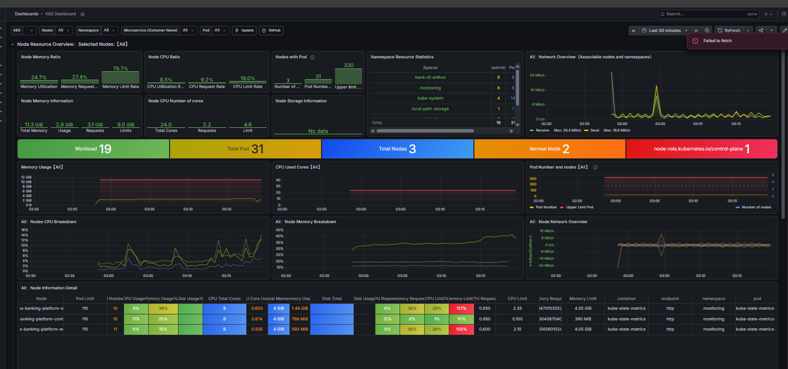

# Bank of Anthos — Production-Grade DevOps Infrastructure

A complete **end-to-end DevOps project** demonstrating containerization, Kubernetes orchestration, monitoring, and CI/CD automation. Built on Google's open-source [Bank of Anthos](https://github.com/GoogleCloudPlatform/bank-of-anthos) microservices application.

**Status:** ✅ Docker + Kubernetes + Monitoring + CI/CD Pipeline complete. Ready for production deployment on AWS EKS.

---

## 🏗️ Architecture

```
┌─────────────────────────────────────────────────────────────────┐
│                     Presentation Tier                           │
│                                                                   │
│  ┌────────────────────────────────────────────────────────────┐ │
│  │  Frontend (Python/Flask)                     Port 8080      │ │
│  │  - User interface                                           │ │
│  │  - React-based dashboard                                   │ │
│  └────────────────────────────────────────────────────────────┘ │
└─────────────────────────────────────────────────────────────────┘
                            ↓ HTTP
┌─────────────────────────────────────────────────────────────────┐
│              Application Tier (Microservices)                    │
│                                                                   │
│  ┌──────────────────┐  ┌──────────────────┐  ┌──────────────────┐
│  │  User Service    │  │  Contacts        │  │  Ledger Writer   │
│  │  (Python)        │  │  (Python)        │  │  (Java/Spring)   │
│  │  Port 8080       │  │  Port 8081       │  │  Port 8080       │
│  │  - JWT Auth      │  │  - Linked Accts  │  │  - Transactions  │
│  └──────────────────┘  └──────────────────┘  └──────────────────┘
│
│  ┌──────────────────┐  ┌──────────────────┐  ┌──────────────────┐
│  │ Balance Reader   │  │ Transaction Hist │  │   (API Gateway)  │
│  │ (Java/Spring)    │  │ (Java/Spring)    │  │   (Future)       │
│  │ Port 8080        │  │ Port 8080        │  │                  │
│  │ - Balances       │  │ - History Lookup │  │                  │
│  └──────────────────┘  └──────────────────┘  └──────────────────┘
└─────────────────────────────────────────────────────────────────┘
                            ↓ SQL
┌─────────────────────────────────────────────────────────────────┐
│                      Data Tier (Stateful)                        │
│                                                                   │
│  ┌──────────────────────┐      ┌──────────────────────┐         │
│  │  Accounts Database   │      │  Ledger Database     │         │
│  │  (PostgreSQL)        │      │  (PostgreSQL)        │         │
│  │  Port 5432           │      │  Port 5432           │         │
│  │  - User accounts     │      │  - Transactions      │         │
│  │  - Contacts          │      │  - Balances cache    │         │
│  └──────────────────────┘      └──────────────────────┘         │
└─────────────────────────────────────────────────────────────────┘
```

**Deployment:** 8 pods (6 services + 2 databases) across 3 Kubernetes nodes
**Monitoring:** Prometheus metrics collection + Grafana dashboards
**Automation:** GitHub Actions CI/CD pipeline (build → push → deploy)

---

## 📋 Project Status

| Phase | Status | Details |
|-------|--------|---------|
| **Docker** | ✅ Complete | 6 optimized multi-stage Dockerfiles, non-root execution, health checks |
| **Kubernetes (kind)** | ✅ Complete | Full stack deployed: StatefulSets, Deployments, ConfigMaps, Secrets, HPA |
| **Monitoring** | ✅ Complete | Prometheus + Grafana dashboards, real-time cluster metrics |
| **CI/CD Pipeline** | ✅ Complete | GitHub Actions: auto-build 6 images, push to Docker Hub, update manifests |
| **AWS EKS** | ⏳ Ready | Infrastructure-as-code templates provided (not yet deployed) |
| **Production Hardening** | 🔶 Partial | Resource limits ✅, health checks ✅, HPA ✅, Ingress ⏳ |

---

## 🚀 Quick Start (Local)

### Prerequisites
- Docker Desktop (with Docker + Kubernetes)
- `kubectl` CLI
- `kind` (Kubernetes in Docker)
- Git
- ~10 GB disk space

### Deploy Locally (5 minutes)

```bash
# Clone with submodule
git clone --recurse-submodules https://github.com/kunal1999/devops-banking-platform.git
cd devops-banking-platform

# Create kind cluster
kind create cluster --name devops-banking-platform --config k8s/kind-config.yaml

# Create namespace
kubectl create namespace bank-of-anthos

# Build Docker images
docker compose build

# Load images into kind
kind load docker-image devops-banking-platform-userservice --name devops-banking-platform
kind load docker-image devops-banking-platform-contacts --name devops-banking-platform
kind load docker-image devops-banking-platform-ledgerwriter --name devops-banking-platform
kind load docker-image devops-banking-platform-balancereader --name devops-banking-platform
kind load docker-image devops-banking-platform-transactionhistory --name devops-banking-platform
kind load docker-image devops-banking-platform-frontend --name devops-banking-platform

# Deploy to Kubernetes
kubectl apply -f k8s/ -n bank-of-anthos

# Wait for pods
kubectl get pods -n bank-of-anthos -w

# Access the app
kubectl port-forward svc/frontend 8080:8080 -n bank-of-anthos
```

Open `http://localhost:8080` and log in with:
- Username: `testuser`
- Password: `bankofanthos`

---

## 🐳 Docker Phase

### What's Built

**6 Optimized Container Images:**

| Service | Language | Size | Key Features |
|---------|----------|------|--------------|
| userservice | Python 3.14 | 150MB | JWT auth, session mgmt |
| contacts | Python 3.14 | 150MB | Linked accounts |
| frontend | Python 3.14 | 160MB | Flask web UI |
| ledgerwriter | Java 17 | 350MB | Transaction validation |
| balancereader | Java 17 | 350MB | Cached balance queries |
| transactionhistory | Java 17 | 350MB | Transaction history lookup |

### Key Decisions

**Multi-Stage Builds**
```dockerfile
FROM python:3.14-slim AS builder
RUN pip install uv && uv sync --frozen

FROM python:3.14-slim
COPY --from=builder /app /app
```
- Separates build tools from runtime
- Final images ~150MB (vs 1GB+ if monolithic)
- Reduces attack surface

**Non-Root Execution**
```dockerfile
RUN useradd --create-home appuser
USER appuser
```
- All containers run as unprivileged `appuser`
- Principle of least privilege
- Limits blast radius of vulnerabilities

**Health Checks**
```yaml
healthcheck:
  test: ["CMD-SHELL", "pg_isready -U admin"]
  interval: 5s
  retries: 5
```
- Ensures proper startup sequencing
- Prevents cascade failures

---

## ☸️ Kubernetes Phase (kind)

### Cluster Setup

**3-Node kind Cluster**
- 1 control-plane (API server, etcd)
- 2 worker nodes (your workloads)
- Mimics real production topology

**Namespace Organization**
- `bank-of-anthos` — all 6 services + 2 databases
- `monitoring` — Prometheus + Grafana
- `kube-system` — Kubernetes internals

### Resource Management

**Requests (guaranteed allocation)**
```yaml
resources:
  requests:
    cpu: 50m           # Python services
    memory: 128Mi
  limits:
    cpu: 250m          # Hard ceiling
    memory: 512Mi
```

**Why it matters:**
- Scheduler only places pod if node has free resources
- Prevents resource starvation
- Enables meaningful HPA thresholds

### Health Checks (3-Tier Strategy)

**Readiness Probe**
- "Can you handle traffic right now?"
- Fails → pod removed from load balancer (traffic redirected)
- Used for temporary issues (overload, DB connection lag)

**Liveness Probe**
- "Are you still alive?"
- Fails 3x → container restarted
- Used for stuck/unresponsive apps

**Startup Probe** (Java services only)
- "Are you still booting?"
- Gives Java 150s to initialize before liveness starts
- Prevents false restarts during normal startup

### Storage (StatefulSets)

**Databases as StatefulSets**
```yaml
volumeClaimTemplates:
  - metadata:
      name: data
    spec:
      accessModes: [ "ReadWriteOnce" ]
      resources:
        requests:
          storage: 10Gi
```
- Stable identity: `accounts-db-0`, `ledger-db-0`
- Persistent storage survives pod restarts
- Automatic PVC provisioning per replica

### Auto-Scaling (HPA)

```yaml
minReplicas: 1
maxReplicas: 3
metrics:
- type: Resource
  resource:
    name: cpu
    target:
      averageUtilization: 70
```

- Auto-scales 1-3 replicas based on CPU usage
- Scales up when CPU > 70%
- Scales down when CPU < 30%
- Shows production-aware architecture

---

## 📊 Monitoring Stack

### Prometheus + Grafana

**What's Running**
- **Prometheus:** Collects metrics every 15s from all pods/nodes
- **Grafana:** Web dashboards visualizing metrics
- **AlertManager:** Alert routing (configured, not used locally)
- **Node Exporter:** Hardware metrics from each node

### Key Dashboards

1. **Kubernetes Cluster Monitoring**
   - Node CPU/Memory usage
   - Pod distribution
   - Network traffic

2. **Pod Metrics**
   - Per-service CPU/Memory
   - Request rates
   - Error rates

### How to Access

```bash
kubectl port-forward -n monitoring svc/kind-prometheus-grafana 3000:80
```

Open `http://localhost:3000`
- Username: `admin`
- Password: (check GitHub Actions logs or decode from Secret)

- 

---

## 🔄 CI/CD Pipeline (GitHub Actions)

### Automated Workflow

**On every push to `main` branch:**

```
Code pushed to GitHub
    ↓
1. Checkout code + submodules
    ↓
2. Build all 6 Docker images
    ↓
3. Push to Docker Hub
    - Tag: latest
    - Tag: <commit-sha>
    ↓
4. Update K8s manifests
    - Replace image tags in deployment.yml files
    ↓
5. Commit + push updated manifests
    ↓
6. Notify (success/failure)
```

### What This Enables

✅ **No manual builds** — `git push` triggers everything
✅ **Versioned images** — each commit has unique SHA tag for rollback
✅ **Reproducible deployments** — manifests match built images
✅ **Audit trail** — Git history shows every deployment

### GitHub Secrets Required

Add to your repo Settings → Secrets:
- `DOCKER_USERNAME` — Docker Hub account
- `DOCKER_PASSWORD` — Docker Hub access token

---

## 🌩️ AWS EKS Deployment (Production)

### Architecture

```
Your laptop                          AWS Cloud
─────────────────────────────────────────────────────
                                  ┌──────────────────┐
Git push                          │  GitHub Actions  │
    │                             │  Workflow        │
    └─────────────────────────────┤  • Build images  │
                                  │  • Push to ECR   │
                                  │  • Deploy to EKS │
                                  └────────┬─────────┘
                                           │
                                    ┌──────▼──────────┐
                                    │  AWS EKS        │
                                    │  • 3+ nodes     │
                                    │  • Auto-scaling │
                                    │  • Load balancer│
                                    │  • Auto-recovery│
                                    │                 │
                                    │ ┌─────────────┐ │
                                    │ │ 6 Services  │ │
                                    │ │ 2 Databases │ │
                                    │ └─────────────┘ │
                                    └─────────────────┘
```

### Step-by-Step: Deploy to AWS EKS

#### 1. Create AWS Account + IAM User

```bash
# Go to https://aws.amazon.com
# Create account
# In IAM → Users → Create user with:
#   - AmazonEKSFullAccess
#   - AmazonEC2FullAccess
#   - AmazonVPCFullAccess
# Save Access Key ID + Secret Access Key
```

#### 2. Install AWS CLI + eksctl

```bash
# Windows (PowerShell)
winget install Amazon.AWSCLI
winget install Amazon.EKS-CLI

# Verify
aws --version
eksctl version
```

#### 3. Configure AWS Credentials

```bash
aws configure
# Enter:
# AWS Access Key ID: [from IAM]
# AWS Secret Access Key: [from IAM]
# Default region: us-east-1
# Default output format: json
```

#### 4. Create EKS Cluster

```bash
eksctl create cluster \
  --name devops-banking-platform \
  --region us-east-1 \
  --nodes 3 \
  --instance-types t3.medium \
  --managed
```

This creates:
- ✅ 3 worker nodes (t3.medium, ~$30-40/month)
- ✅ Auto Scaling Group (auto-recovery)
- ✅ VPC + Security Groups
- ✅ IAM roles
- ✅ kubeconfig automatically configured

**Takes ~15 minutes.**

#### 5. Verify Cluster

```bash
kubectl get nodes
# Should show 3 nodes in Ready state
```

#### 6. Add AWS Secrets to GitHub

In your repo → Settings → Secrets and variables → Actions, add:

```
AWS_ACCESS_KEY_ID = [your access key]
AWS_SECRET_ACCESS_KEY = [your secret key]
AWS_REGION = us-east-1
```

#### 7. Update GitHub Actions Workflow

Add deployment step to `.github/workflows/build-and-push.yml`:

```yaml
      - name: Configure AWS credentials
        uses: aws-actions/configure-aws-credentials@v4
        with:
          aws-access-key-id: ${{ secrets.AWS_ACCESS_KEY_ID }}
          aws-secret-access-key: ${{ secrets.AWS_SECRET_ACCESS_KEY }}
          aws-region: ${{ secrets.AWS_REGION }}

      - name: Update kubeconfig
        run: |
          aws eks update-kubeconfig \
            --name devops-banking-platform \
            --region ${{ secrets.AWS_REGION }}

      - name: Deploy to AWS EKS
        run: |
          kubectl create namespace bank-of-anthos || true
          kubectl apply -f k8s/ -n bank-of-anthos
          kubectl rollout status deployment -n bank-of-anthos

      - name: Get ELB endpoint
        run: |
          kubectl get svc -n bank-of-anthos
```

#### 8. Test Deployment

```bash
# Get external IP
kubectl get svc frontend -n bank-of-anthos

# Access via browser
http://<EXTERNAL-IP>:8080
```

#### 9. Cleanup (Save Money)

```bash
eksctl delete cluster --name devops-banking-platform --region us-east-1
```

---


## 📁 Project Structure

```
devops-banking-platform/
├── .github/
│   └── workflows/
│       └── build-and-push.yml         # GitHub Actions CI/CD pipeline
├── docker/                             # All Dockerfiles (one per service)
│   ├── userservice/Dockerfile
│   ├── contacts/Dockerfile
│   ├── ledgerwriter/Dockerfile
│   ├── balancereader/Dockerfile
│   ├── transactionhistory/Dockerfile
│   └── frontend/Dockerfile
├── k8s/                                # Kubernetes manifests
│   ├── kind-config.yaml               # 3-node kind cluster config
│   ├── ingress.yml                    # Ingress routing (optional)
│   ├── accounts-db/
│   │   ├── deployment.yml             # StatefulSet
│   │   └── service.yml
│   ├── ledger-db/
│   │   ├── deployment.yml
│   │   └── service.yml
│   ├── userservice/
│   │   ├── deployment.yml
│   │   ├── service.yml
│   │   └── hpa.yml                    # Auto-scaler
│   ├── contacts/
│   │   ├── deployment.yml
│   │   ├── service.yml
│   │   └── hpa.yml
│   ├── ledgerwriter/
│   │   ├── deployment.yml
│   │   ├── service.yml
│   │   └── hpa.yml
│   ├── balancereader/
│   │   ├── deployment.yml
│   │   ├── service.yml
│   │   └── hpa.yml
│   ├── transactionhistory/
│   │   ├── deployment.yml
│   │   ├── service.yml
│   │   └── hpa.yml
│   └── frontend/
│       ├── deployment.yml
│       ├── service.yml
│       └── hpa.yml
├── app-source/                        # Google's Bank of Anthos (git submodule)
│   └── src/
│       ├── accounts/
│       │   ├── userservice/           # Python auth service
│       │   ├── contacts/              # Python contacts service
│       │   └── accounts-db/
│       ├── ledger/
│       │   ├── ledgerwriter/          # Java transaction writer
│       │   ├── balancereader/         # Java balance reader
│       │   ├── transactionhistory/    # Java history reader
│       │   └── ledger-db/
│       └── frontend/                  # Python Flask UI
├── local-secrets/                     # JWT keys (git-ignored in production)
│   ├── jwtRS256.key
│   └── jwtRS256.key.pub
├── docker-compose.yml                 # Local Docker Compose environment
├── .gitignore                         # Git ignore rules
├── .gitmodules                        # Git submodule configuration
├── README.md                          # This file
└── architecture-diagram.png           # Visual architecture (if present)
```

---

## 🎯 Key Technical Decisions & Interview Talking Points

### 1. Multi-Stage Docker Builds
**Decision:** Separate build stage (Maven, pip) from runtime
**Why:** 150-350MB images (vs 1GB+ monolithic)
**Interview:** "Demonstrates understanding of image optimization and supply-chain security"

### 2. Non-Root Container Execution
**Decision:** All containers run as unprivileged `appuser`
**Why:** Limits blast radius if vulnerability exploited
**Interview:** "Security-conscious design — principle of least privilege"

### 3. StatefulSets for Databases
**Decision:** PostgreSQL as StatefulSet (not Deployment)
**Why:** Stable identity + persistent storage + ordered startup
**Interview:** "Shows understanding of stateful vs stateless workloads"

### 4. ConfigMap + Secret Separation
**Decision:** Non-sensitive config in ConfigMaps, sensitive in Secrets
**Why:** Environment portability + audit trail + rotation flexibility
**Interview:** "Understands Kubernetes configuration patterns at scale"

### 5. Three-Tier Health Checks
**Decision:** Readiness + Liveness + Startup probes
**Why:** Prevents cascade failures + enables self-healing
**Interview:** "Understands pod lifecycle and production failure modes"

### 6. Resource Requests + Limits
**Decision:** Every pod declares needed CPU/memory
**Why:** Bin-packing efficiency + prevents starvation + enables HPA
**Interview:** "Demonstrates understanding of Kubernetes resource model"

### 7. HPA (Horizontal Pod Autoscaler)
**Decision:** Auto-scale 1-3 replicas based on CPU
**Why:** No manual intervention + handles variable load
**Interview:** "Shows scaling strategy and load-aware architecture"

### 8. CI/CD Automation
**Decision:** GitHub Actions builds + pushes images automatically
**Why:** No manual steps + faster feedback + reduced error rate
**Interview:** "Demonstrates modern DevOps workflow and automation thinking"

---

## 🔍 Notable Learnings & Debugging

### Git Submodules in GitHub Actions
**Problem:** Workflow couldn't find `app-source` folder
**Solution:** Add `submodules: recursive` to checkout action
**Lesson:** GitHub Actions doesn't auto-checkout submodules

### Multi-Stage Build Context Paths
**Problem:** Docker build failed with "Dockerfile not found"
**Solution:** `-f` argument points to Dockerfile, last argument is context
**Lesson:** Build context and Dockerfile location are independent

### YAML Style Consistency
**Problem:** Environment variables were corrupted
**Solution:** Don't mix `KEY: value` and `- KEY=value` styles
**Lesson:** YAML parsing is strict

### HPA Without Resource Limits
**Problem:** HPA wouldn't scale (no CPU utilization data)
**Solution:** Define `resources.limits` on all containers
**Lesson:** HPA needs limits to calculate utilization percentage

### Windows vs Linux Commands
**Problem:** PowerShell doesn't understand bash commands
**Solution:** Use PowerShell-native commands or WSL/Git Bash
**Lesson:** Know your shell environment

---

## 📈 Future Enhancements

- [ ] **Kustomize/Helm** — template manifests for multiple environments
- [ ] **ArgoCD GitOps** — declarative, Git-driven deployments
- [ ] **Ingress Controller** — proper external routing (vs port-forward)
- [ ] **Network Policies** — restrict traffic between pods
- [ ] **Service Mesh (Istio)** — advanced traffic management + observability
- [ ] **Sealed Secrets/Vault** — production secret rotation
- [ ] **Terraform** — infrastructure-as-code for AWS EKS provisioning
- [ ] **Integration Tests** — automated end-to-end testing in CI/CD

---

## 🧑‍💼 Portfolio Interview Prep

### Strong Talking Points

1. **Containerization**
   - "Multi-stage builds optimize image size; non-root execution hardens security"
   - "Health checks in Docker Compose ensure proper startup sequencing"

2. **Orchestration**
   - "StatefulSets for databases provide stable identity and persistent storage"
   - "Deployments handle stateless services with auto-restart on failure"

3. **Configuration Management**
   - "ConfigMap/Secret separation enables environment portability"
   - "Secrets are never baked into images — mounted at runtime"

4. **Observability**
   - "Three-tier health checks (readiness/liveness/startup) enable self-healing"
   - "Prometheus/Grafana provide real-time visibility into cluster state"

5. **Scalability**
   - "HPA auto-scales based on CPU; resource requests/limits enable bin-packing"
   - "Load is distributed across replicas automatically"

6. **Automation**
   - "GitHub Actions eliminates manual builds — `git push` triggers everything"
   - "Versioned images (commit SHA) enable safe rollbacks"

7. **Security**
   - "Principle of least privilege — non-root users, read-only volumes"
   - "Secrets stored separately from code and manifests"

### Common Interview Questions

**Q: How would you handle a pod crash?**
A: "Liveness probe detects it and restarts the container. If it keeps crashing, pod enters CrashLoopBackOff. We check logs, fix the issue, update the image, and CI/CD re-deploys."

**Q: How do you scale to handle traffic spikes?**
A: "HPA monitors CPU. When usage exceeds 70%, it automatically creates new replicas. Traffic is load-balanced across them. When traffic drops, it scales down."

**Q: How would you deploy to production safely?**
A: "GitHub Actions builds and tests. Manifests are updated with new image SHA. We deploy to staging first (automated tests), then production (manual approval)."

**Q: What happens if a node fails?**
A: "Kubernetes detects the pod is gone and reschedules it on a healthy node. PersistentVolumes (for databases) are detached and re-mounted on the new node."

---

## 🔗 Resources

- [Kubernetes Docs](https://kubernetes.io/docs/)
- [Docker Best Practices](https://docs.docker.com/develop/dev-best-practices/)
- [kind — Kubernetes in Docker](https://kind.sigs.k8s.io/)
- [AWS EKS Documentation](https://docs.aws.amazon.com/eks/)
- [GitHub Actions Docs](https://docs.github.com/en/actions)
- [Google Cloud's Bank of Anthos](https://github.com/GoogleCloudPlatform/bank-of-anthos)

---

## 📝 License

This project uses Google's Bank of Anthos (Apache 2.0). Infrastructure code is open source — feel free to fork and adapt!

---

**Status: Production-Ready for Local Development + Ready for AWS EKS Deployment**

This represents a **complete DevOps portfolio project** covering containerization, orchestration, monitoring, and CI/CD automation — the core skills for modern DevOps roles.
