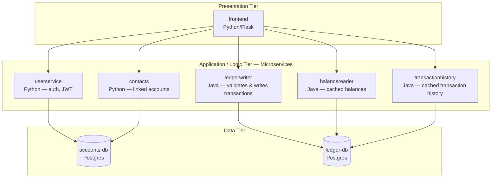

# devops-banking-platform

A fully containerized, 6-service microservices banking platform (Python + Java), 
with a working web UI, PostgreSQL databases, JWT authentication, and real 
service-to-service communication — running entirely locally via Docker Compose. 
Built around Google's open-source Bank of Anthos demo app.

**App code**: unmodified, from [GoogleCloudPlatform/bank-of-anthos](https://github.com/GoogleCloudPlatform/bank-of-anthos) 
(Apache 2.0), included as a git submodule.
**Everything else** — Dockerfiles, Docker Compose environment, Kubernetes 
manifests, CI/CD, monitoring — built from scratch, by me.

## Architecture



3-tier architecture: a Flask frontend, five backend microservices (Python + Java) 
handling authentication and transactions, and two Postgres databases.

## Progress

- [x] Multi-stage Dockerfiles for all 6 services (`userservice`, `contacts`, 
      `ledgerwriter`, `balancereader`, `transactionhistory`, `frontend`)
- [x] Local docker-compose environment: both databases running with schema 
      and demo data auto-loaded on startup
- [x] All 6 services running together via Compose, fully verified end-to-end
- [x] JWT-based authentication verified end-to-end (login → signed token → 
      verified across services)
- [x] Real service-to-service communication working across the whole stack
- [ ] Kubernetes manifests
- [ ] CI/CD pipeline (GitHub Actions)
- [ ] Monitoring (Prometheus/Grafana)
- [ ] Canary deployments (Argo Rollouts) + cost-aware autoscaling (Karpenter) on AWS

## Tech stack

Docker, Docker Compose, PostgreSQL, Python (Flask), Java (Spring Boot/Maven), 
Kubernetes (planned), GitHub Actions (planned), Prometheus/Grafana (planned)

## Running locally

**Prerequisites**: Docker Desktop, Git

```bash
git clone --recurse-submodules https://github.com/<your-username>/devops-banking-platform.git
cd devops-banking-platform
docker compose up --build
```

This starts all 6 services and both databases (schema + demo data pre-loaded). 
Once running: