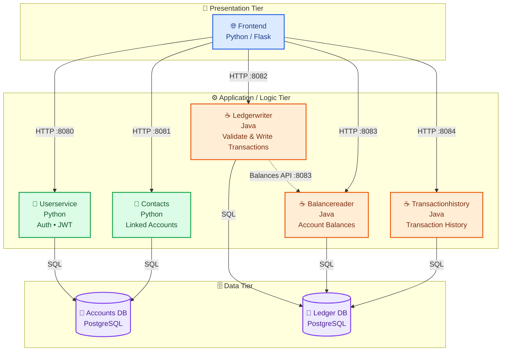

# devops-banking-platform

A fully containerized, 6-service microservices banking platform (Python + Java), 
with a working web UI, PostgreSQL databases, JWT authentication, and real 
service-to-service communication — running entirely locally via Docker Compose. 
Built around Google's open-source Bank of Anthos demo app.

**App code**: unmodified, from [GoogleCloudPlatform/bank-of-anthos](https://github.com/GoogleCloudPlatform/bank-of-anthos) 
(Apache 2.0), included as a git submodule.
**Everything else** — Dockerfiles, Docker Compose environment, Kubernetes 
manifests, CI/CD, monitoring — built from scratch, by me.

## Architecture

<p align="center">
  
</p>


## 🏗️ Architecture



### 🔗 Communication

| Connection                       | Type         | Purpose                             |
| -------------------------------- | ------------ | ----------------------------------- |
| `frontend → userservice`         | HTTP         | Authentication & user operations    |
| `frontend → contacts`            | HTTP         | Contact / linked account operations |
| `frontend → ledgerwriter`        | HTTP         | Create transactions                 |
| `frontend → balancereader`       | HTTP         | Retrieve balances                   |
| `frontend → transactionhistory`  | HTTP         | Retrieve transaction history        |
| `userservice → accounts-db`      | SQL          | User/account data                   |
| `contacts → accounts-db`         | SQL          | Contact/account data                |
| `ledgerwriter → ledger-db`       | SQL          | Write transactions                  |
| `balancereader → ledger-db`      | SQL          | Read balances                       |
| `transactionhistory → ledger-db` | SQL          | Read transaction history            |
| `ledgerwriter → balancereader`   | Internal API | Balance validation                  |

> **Note:** Solid arrows represent API/database communication. Dashed arrows represent **service-to-service dependencies**.

3-tier architecture: a Flask frontend, five backend microservices (Python + Java) 
handling authentication and transactions, and two Postgres databases.

## Progress

- [x] Multi-stage Dockerfiles for all 6 services (`userservice`, `contacts`, 
      `ledgerwriter`, `balancereader`, `transactionhistory`, `frontend`)
- [x] Local docker-compose environment: both databases running with schema 
      and demo data auto-loaded on startup
- [x] All 6 services running together via Compose, fully verified end-to-end
- [x] JWT-based authentication verified end-to-end (login → signed token → 
      verified across services)
- [x] Real service-to-service communication working across the whole stack
- [ ] Kubernetes manifests
- [ ] CI/CD pipeline (GitHub Actions)
- [ ] Monitoring (Prometheus/Grafana)
- [ ] Canary deployments (Argo Rollouts) + cost-aware autoscaling (Karpenter) on AWS

## Tech stack

Docker, Docker Compose, PostgreSQL, Python (Flask), Java (Spring Boot/Maven), 
Kubernetes (planned), GitHub Actions (planned), Prometheus/Grafana (planned)

## Running locally

**Prerequisites**: Docker Desktop, Git

```bash
git clone --recurse-submodules https://github.com/<your-username>/devops-banking-platform.git
cd devops-banking-platform
docker compose up --build
```

This starts all 6 services and both databases (schema + demo data pre-loaded). 
Once running:
